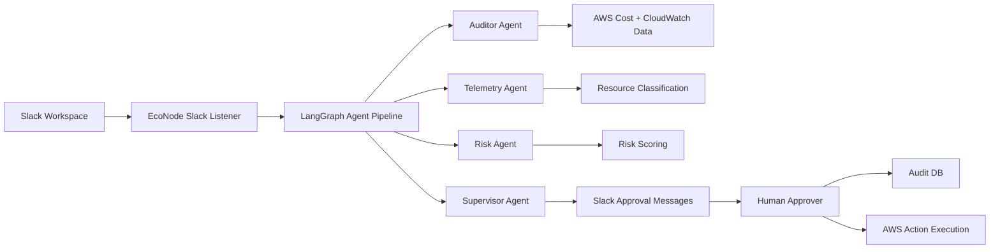

# EcoNode Architecture Diagram

```mermaid
flowchart LR
A[Slack Workspace] --> B[EcoNode Slack Listener]
B --> C[LangGraph Agent Pipeline]
C --> D[Auditor Agent]
C --> E[Telemetry Agent]
C --> F[Risk Agent]
C --> G[Supervisor Agent]
D --> H[AWS Cost + CloudWatch Data]
E --> I[Resource Classification]
F --> J[Risk Scoring]
G --> K[Slack Approval Messages]
K --> L[Human Approver]
L --> M[Audit DB]
L --> N[AWS Action Execution]
```
