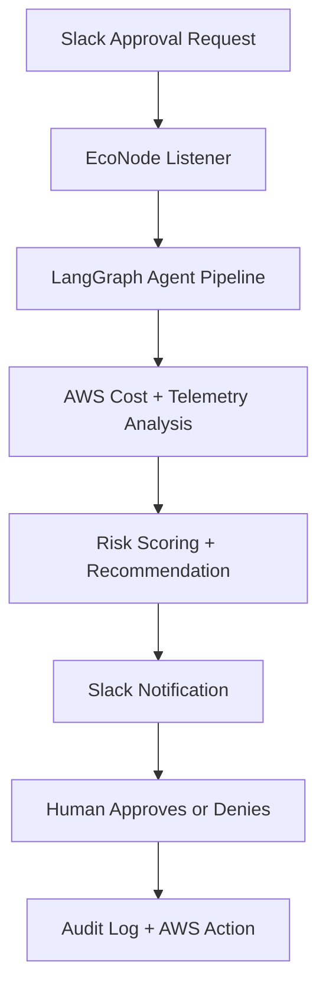

# EcoNode — Hackathon Submission Pack

## Recommended Track
Slack Agent for Good

## Why EcoNode Fits
EcoNode is a Slack-powered agent that helps teams reduce cloud waste and energy use by detecting underutilized AWS resources, scoring risks, and sending human-in-the-loop approval requests directly inside Slack. It addresses environmental sustainability by helping organizations cut unnecessary compute usage and reduce their cloud footprint.

## Project Summary
EcoNode is an autonomous FinOps assistant that watches AWS resources, identifies waste, calculates potential savings, and asks a human to approve or deny remediation actions in Slack. The system combines LangGraph-based agents, AWS telemetry, and Slack notifications to turn cloud optimization into a safe, auditable workflow.

## Core Features
- Audits AWS cost and telemetry data for idle or wasteful resources
- Classifies resources as ZOMBIE, UNDERUTILIZED, or HEALTHY
- Scores SLA risk before recommending action
- Sends a Slack approval request for each actionable resource
- Supports approve / deny / status commands from Slack
- Logs all decisions in an audit trail for transparency

## Social Impact
EcoNode helps organizations reduce unnecessary cloud consumption, which directly lowers energy waste and infrastructure overhead. By making optimization visible and actionable inside Slack, it can help small teams and nonprofits operate more efficiently without adding manual FinOps workload.

## Demo Video Outline
1. Open with the problem: wasted cloud resources and rising compute costs.
2. Show EcoNode scanning resources and generating savings analysis.
3. Show the Slack approval request with the risk assessment and savings estimate.
4. Show the human approving or denying the action in Slack.
5. End with the audit trail and the resulting cost-saving outcome.

## Architecture Diagram

## Submission Copy
### Short Description
EcoNode is a Slack-native cloud optimization agent that detects wasted AWS resources, scores risk, and requires human approval before any action is taken.

### Impact Statement
EcoNode turns cloud waste reduction into a practical, human-supervised Slack workflow. It helps teams save money, cut unnecessary compute usage, and reduce the environmental impact of overprovisioned infrastructure.

## Submission Checklist
- Track: Slack Agent for Good
- Text description: ready above
- Impact explanation: ready above
- Demo video: script prepared
- Architecture diagram: included above
- Slack sandbox URL: add once the app is deployed
- Access for slackhack@salesforce.com and testing@devpost.com: grant after app setup
